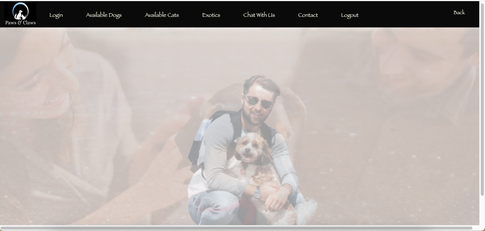
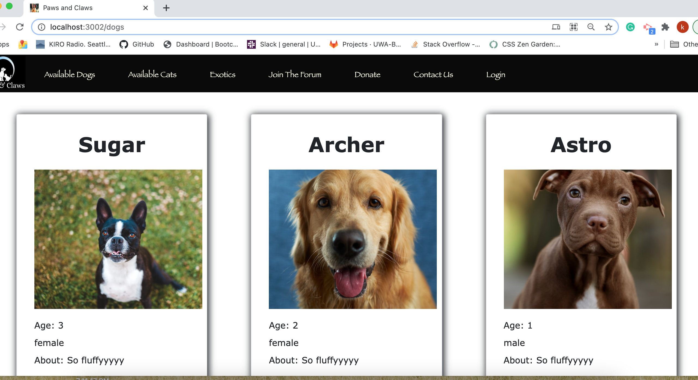

# Paws & Claws
Project 2 

## Table of Contents

* [Overview](#overview)
* [Built With](#builtwith)
* [Deployment](#deployment)
* [Contributers](#contributers)
* [Usage](#usage)
* [Credits](#credits)
* [License](#license)

## Overview
The purpose of this app is to have the user search through the database for a new pet to adopt.  The users will be able to search the webpage to find pets that fit the users and their family. If someone wants to browse available pets in the area, they can go straight to the "Dogs" "Cats" or "Exotics" link from the home page as long as they are loggin in first.

## Built With
* VS Code
* HTML
* CSS
* Bootstrap
* Javascript
* Heroku
* NPM
* Mysql

## Deployment
The app is deployed with Heroku

## Contributers
1. https://github.com/kirmarnel Kirsten Nelson
2. https://github.com/j-toups Joesph Toups
3. https://github.com/MarisaHanna Marisa Hanna
4. https://github.com/Ofarrell23 Keya Bernhardt

## Usage 

## Credits

Below is a list of third-party tutorials used to help facilitate this project. 
* [Credits] (https://www.w3schools.com/tags/att_img_alt.asp)
* [Credits] (https://www.vikingcodeschool.com/html5-and-css3/html5-semantic-tags)
* [Credits] (https://developer.mozilla.org/en-US/docs/Web/JavaScript)
* [Credits] (https://tailwindcss.com/docs/installation)
* [Credits] (https://www.jqueryscript.net/)
* [Credits] (https://getbootstrap.com/)

## License

[https://choosealicense.com/licenses/gpl-3.0/](https://choosealicense.com/licenses/gpl-3.0/) 
